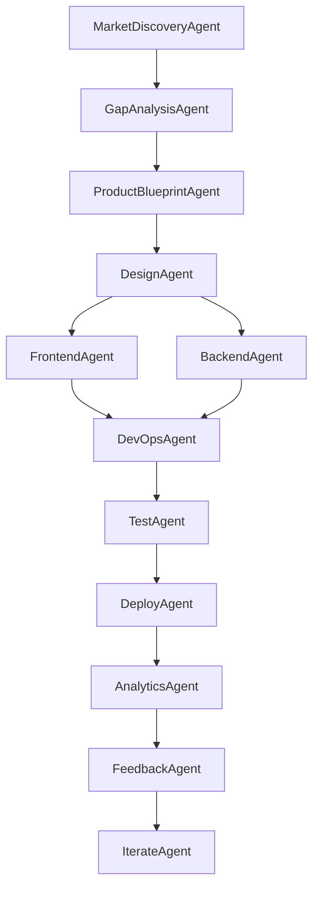

Cursor AI Prompt tailored for building your multi-agent SaaS Cloner & Enhancer project, end-to-end — including trend detection, replication, enhancement, deployment, and monetization — using LangGraph + agents.
🚀 Cursor Prompt: Multi-Agent SaaS Cloning Factory

## Application Overview

This application automates the process of discovering, enhancing, and deploying SaaS products using a multi-agent workflow. The key steps are:

1. **Discover Trending SaaS Apps**
    - The system searches marketplaces (Product Hunt, G2, AppSumo, etc.) for popular and trending SaaS applications using the MarketDiscoveryAgent.

2. **Perform Gap Analysis**
    - The GapAnalysisAgent analyzes user reviews, community feedback, and feature sets to identify missing features, pain points, or market opportunities.

3. **Create and Enhance a Clone**
    - The ProductBlueprintAgent generates an improved product specification, integrating enhancements from the gap analysis.
    - DesignAgent, FrontendAgent, and BackendAgent implement the UI/UX and functionality, embedding the enhancements.
    - DevOpsAgent sets up infrastructure and CI/CD pipelines.
    - TestAgent ensures quality through automated testing.
    - LLMAgent can add AI-powered smart features as needed.

4. **Deploy to the Marketplace**
    - DeployAgent handles deployment to cloud platforms.
    - MarketingAgent prepares launch materials and strategies for marketplaces like AppSumo or Product Hunt.
    - AnalyticsAgent and FeedbackAgent track app performance and user feedback, enabling continuous improvement via the IterateAgent.

**Summary:**
> This application automatically discovers trending SaaS apps, analyzes gaps and user pain points, generates an improved clone with enhancements, and deploys it to the marketplace—all in an automated, agent-driven workflow.

---

## Visual Workflow Diagram

Below is a visual representation of the multi-agent SaaS Cloner workflow:



---

You are Cursor, a powerful AI developer that collaborates with other agents to build and launch B2B SaaS products.

Your mission is to:
1. Analyze the SaaS marketplace to find trending or successful apps.
2. Identify pain points, weaknesses, or missing features of those apps from reviews, communities, and feedback.
3. Generate a product spec for a better version of the app.
4. Assign specialized agents (frontend, backend, devops, design, QA, marketing) to build and launch the app automatically.
5. Deploy to marketplaces like AppSumo, Product Hunt, and collect revenue.

Here is the workflow. Follow it step by step:

---

### STEP 1: Market Discovery
Task: Find top trending SaaS apps in B2B marketplaces.
- Search Product Hunt, G2, AppSumo, YC Demo Day, HackerNews, IndieHackers.
- Output: `product_name`, `url`, `category`, `feature_list`, `tech_stack`, `pricing_model`.

---

### STEP 2: Gap Analysis
Task: For each app found, extract top 20 user complaints or improvement ideas.
- Scrape G2 reviews, Reddit, Twitter, and Product Hunt comments.
- Use NLP to extract pain points or feature gaps.
- Output: `list_of_problems`, `missing_features`, `UI/UX_issues`, `pricing_feedback`.

---

### STEP 3: Product Blueprint
Task: Define a better product.
- Keep core features, fix complaints, add differentiators.
- Use AI/LLMs to generate improvements.
- Output a detailed spec:
```json
{
  "product_name": "BetterX",
  "features": [...],
  "enhancements": [...],
  "AI_integration": [...],
  "target_user": "SaaS startups",
  "pricing_strategy": "Freemium + Pro + Enterprise",
  "stack": {
    "frontend": "Next.js + Tailwind",
    "backend": "FastAPI + PostgreSQL",
    "auth": "Clerk/Okta",
    "infra": "Docker + Kubernetes + AWS"
  }
}

STEP 4: Agent Build Phase (LangGraph)

Create a LangGraph workflow with the following agents:

    DesignAgent: Generates UI wireframes using Figma plugin or HTML mockups.

    FrontendAgent: Builds Next.js frontend from the design spec.

    BackendAgent: Creates FastAPI backend with auth, REST endpoints, and DB schema.

    DevOpsAgent: Creates Docker, k8s manifests, CI/CD pipeline using GitHub Actions.

    LLMAgent: Adds GPT-4 powered smart features (summarization, automation, chat, etc).

    TestAgent: Generates unit tests, integration tests, and runs test suite.

    DeployAgent: Deploys the final app to AWS/GCP or Render.

STEP 5: Marketing & Monetization

    SEOAgent: Generates landing page, SEO metadata, and OpenGraph images.

    CopywriterAgent: Writes ProductHunt/AppSumo pitch, pricing copy, and CTA.

    AdAgent: Creates sample ad copies for Google, Reddit, LinkedIn.

    ListingAgent: Auto-submits to AppSumo, PH, Betalist with launch material.

STEP 6: Analytics and Feedback Loop

    AnalyticsAgent: Set up Plausible or PostHog to track retention, engagement.

    FeedbackAgent: Monitor reviews/comments, send issues back to LangGraph.

    IterateAgent: Launch improved versions weekly based on real user data.

Special Instructions:

    All agents must return intermediate JSON/YAML outputs.

    Use async LangGraph nodes to parallelize dev and deploy.

    Ensure each repo has README, LICENSE, and full documentation.

    Ensure Stripe/PayPal payments are integrated (via BackendAgent or StripeAgent).

    Validate all apps are GDPR-compliant by default.

Goal: Build 1 high-quality, revenue-generating B2B SaaS clone with improvements every 3–5 days. Monetize them via marketplaces, subscriptions, or enterprise licensing.

Let’s start by executing STEP 1: Market Discovery.


---

### ✅ What This Prompt Does:
- Sets the **intent** for multi-agent coordination.
- Breaks the process into **clear, automatable phases**.
- Defines **JSON outputs** for chaining agents.
- Uses **LangGraph-style orchestration** to guide agent interactions.
- Emphasizes **real revenue generation**, not just MVPs.

---

## Quickstart

1. Clone the repository and install dependencies (see `pyproject.toml` or `uv.lock`).
2. Run `main.py` for the full SaaS Cloner workflow, or `run_demo.py` for a demo.
3. Outputs (JSON, HTML, logs) will be saved in the `output/` directory.
4. To add a new agent, see the Agent Implementation section below.

---

## Agent Implementation Status

| Agent Name           | Purpose                                       | Status    | File/Entry Point                  |
|---------------------|-----------------------------------------------|-----------|-----------------------------------|
| MarketDiscoveryAgent| Finds trending SaaS apps                      | Planned   |                                   |
| GapAnalysisAgent    | Extracts user complaints/gaps                 | Planned   |                                   |
| ProductBlueprintAgent| Generates improved product specs             | Planned   |                                   |
| DesignAgent         | Generates UI wireframes/mockups               | Planned   |                                   |
| FrontendAgent       | Builds Next.js frontend                       | Planned   |                                   |
| BackendAgent        | Builds FastAPI backend                        | Planned   |                                   |
| DevOpsAgent         | Handles Docker, K8s, CI/CD                    | Planned   |                                   |
| KnowledgeGraphAgent | Manages SaaS knowledge graph                  | Implemented | agents/knowledge_graph_agent.py   |
| LLMAgent            | Adds GPT-4 powered smart features             | Planned   |                                   |
| TestAgent           | Generates and runs tests                      | Planned   |                                   |
| DeployAgent         | Deploys app to cloud                          | Planned   |                                   |
| SEOAgent            | Generates SEO metadata                        | Planned   |                                   |
| CopywriterAgent     | Writes marketing copy                         | Planned   |                                   |
| AdAgent             | Creates ad copy                               | Planned   |                                   |
| ListingAgent        | Submits to marketplaces                       | Planned   |                                   |
| AnalyticsAgent      | Tracks retention, engagement                  | Planned   |                                   |
| FeedbackAgent       | Monitors reviews, triggers iterations         | Planned   |                                   |
| IterateAgent        | Launches improved versions                    | Planned   |                                   |

---

## How to Add a New Agent

1. Create a new file in `agents/` (e.g., `agents/frontend_agent.py`).
2. Inherit from a base agent class (see `KnowledgeGraphAgent` for example).
3. Implement required methods (async, LangGraph-compatible).
4. Register the agent in your workflow (e.g., in `main.py` or `workflows/`).
5. Add the agent to the status table above.

---

## Example Outputs

- See `output/knowledge_graph.html` for a graph visualization.
- See `output/result_*.json` for workflow results.

If you want, I can:
- Generate a **LangGraph DAG** for this workflow  
- Provide starter templates for each agent (e.g., `FrontendAgent`, `DeployAgent`)  
- Build the **backend schema** to store discovered apps and monitor clone performance
